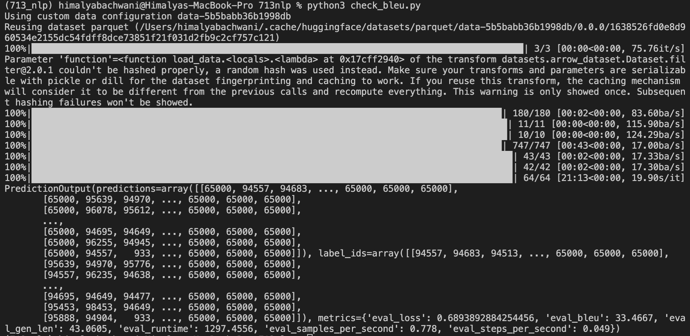
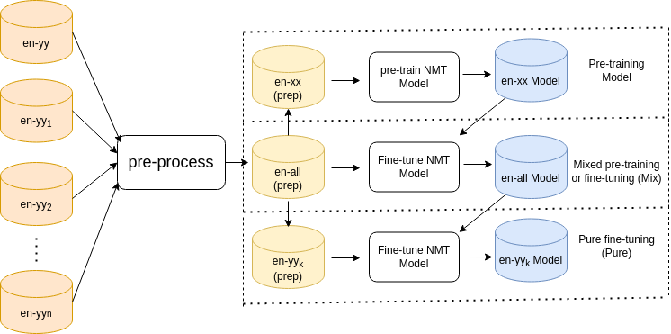
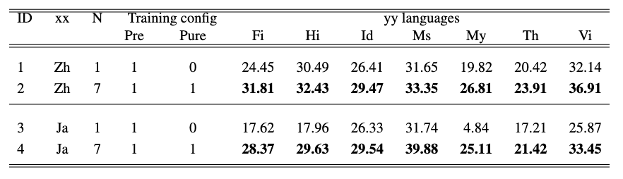
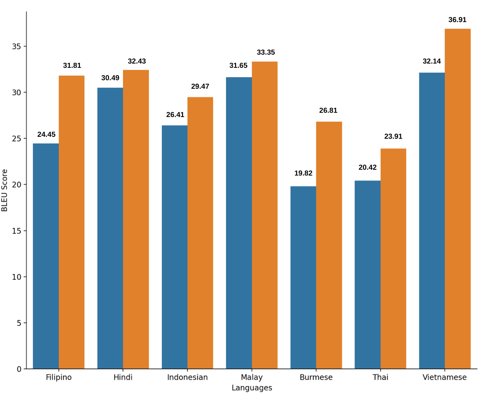
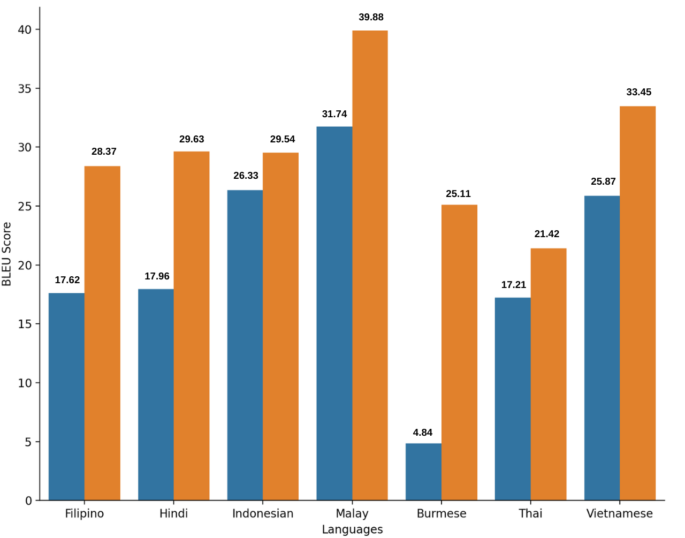

## CMPT 713 Project
# Polyglot Refinement: Neural Machine Translation for Low Resource Languages

In a one-to-many low-resource neural machine translation (NMT) setting, we wish to demonstrate the impressive utility of multi-parallel corpora for transfer learning. We present results from a systematic evaluation of multistage fine-tuning configurations, which include pre-training on a large parallel external corpus for both the English language and a supporting target language i.e. Asian languages. Our work is a recreation of(Dabreet al., 2019). We extend their work by using state-of-art tokenizers to tokenize Asian language sentences. In order to demonstrate the true power of multilingualism, we are attempting to show that multi-parallel corpora are incredibly useful despite their rarity and content related redundancy. We observed that this multistage fine-tuning can result in 4–8 BLEU score gains over a straightforward one–to–one model, even when the helping target language is not one of the target languages of our concern.

## How To Run

For training the model and analysing them, *polyglot_nmt.ipynb* notebook was used.

In order to train the model on a specific target language change the *yylang/ target_lang* parametre from the notebook. If you wish to train on differen helper language (chinese(zh)/ japanese(ja)) change the *xxlang* parametre.

To test the BLEU score of the model run the comman below
```
python check_bleu.py --model <model-name> --targetlang <target-language>
```
For Example,

```
python check_bleu.py --model NMT_PFT_en-zh-to-ms --targetlang ms
```

The above code will produce the resuls below: 


*Figure 01:Output of the polyglot_check.py*


The models can be found [here](https://drive.google.com/drive/folders/1IJw_hmjMfxxPXdxaLrTtI4WGuyECy4Ee?usp=sharing).

## Dataset

### [ALT](https://www2.nict.go.jp/astrec-att/member/mutiyama/ALT/)
We used the ALT multilingual multi-parallel corpus (Riza et al., 2016) as our test corpora because it provides identical test sentences in various languages, enabling us to establish whether multilingualism is actually the source of better translation quality. As the Asian target languages (i.e., yy) we have considered the following languages for our analysis: Filipino (fi), Hindi (hi), Indonesian (id), Burmese (ms), Malay (my), Thai (th), and Vietnamese (vi) from the family of Asian languages. This dataset is tokenized using a mbart50-like tokenizer. We randomly divided the ALT data into 18000 train, 1000 validation and 1000 test multi-parallel sentences for training, development, and testing.

### [Opus100](https://opus.nlpl.eu/opus-100.php) 
We used two parallel corpora with two different target languages for the resource-rich en-xx data. One such corpus is the English-Chinese corpus (Opus En-Zh), which contains 209,491 parallel sentences. We chose it to see if the target language (Chinese) other than the target languages in our context is useful. Separately, we experimented with the English-Japanese corpus (Opus En-Ja), which contains 440,288 parallel sentences of Japanese-to-English translation.


## Training 

We first fine-tuned a pre-trained model on a parallel corpus for the resource-rich language pair single pair en-xx([Huggingface-en-zh](https://huggingface.co/Helsinki-NLP/opus-mt-en-zh)). As a next step we finetuned the pre-trained model on a parallel dataset of the Asian languages. Later this resultant mode is finetuned further on the single target language.


*Figure 01: Training Approach used in the project.*

## Results


*Figure 02:BLEU Scores of the models*


*Figure 03: Base Language Chinese*


*Figure 04: Base Language Japanese*


